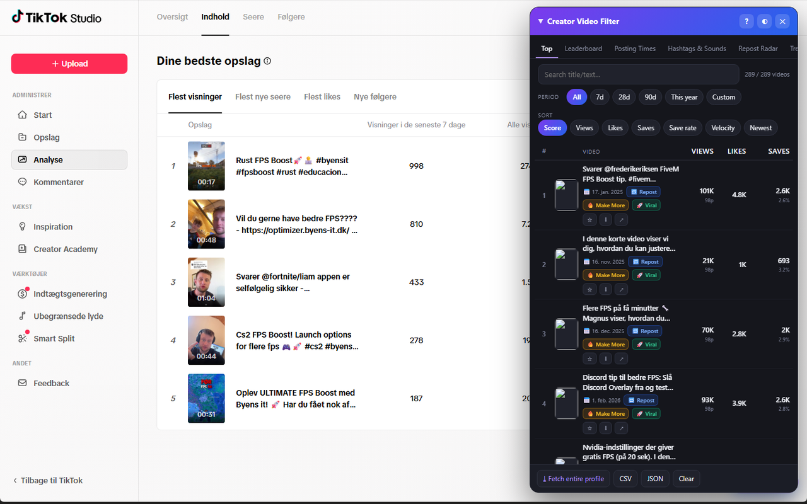

# Creator Video Filter for TikTok

A free, privacy-first Chrome extension that turns your own TikTok video data into an on-page analytics panel — entirely in your browser.

> Store name: **Creator Video Filter for TikTok** · maintained by **Byens IT**. Not affiliated with TikTok.

[](./LICENSE)
[](https://developer.chrome.com/docs/extensions/mv3/intro/)
[](#contributing)

Sort, rank, and understand your own TikTok videos locally — no account linking, no uploads, no servers.

> ⚠️ **Not affiliated with TikTok.** This extension helps creators analyze their own visible TikTok data locally in the browser.

---

## Screenshot



*The analytics panel overlaid on TikTok Studio — your top videos ranked by score, with badges, period filter, and sorting controls. More shots in [`store/screenshots/`](store/screenshots/README.md).*

---

## Features

**Analytics panel (tabbed)**
- **Top list** — sort your videos by Score, Views, Likes, Saves, Save-rate, Velocity, or Newest.
- **Save-rate Leaderboard** — rank videos by save-rate with percentile badges.
- **Posting Times** — a 7×24 heatmap built from your post timestamps to spot your best windows.
- **Hashtags & Sounds** — performance breakdown by hashtag and sound.
- **Repost Radar** — surfaces older videos worth reposting.
- **Trends** — compare periods and spot view-velocity "sleeper hits".
- **Watchlist** — keep an eye on specific videos over time.

**Badges (at a glance)**
- 🔁 Repost Candidate
- 🔥 Make More
- 🚀 Viral Reach
- 💾 Utility Winner
- 🆕 Too Early
- ⚠️ Missing Fresh Data

**Filtering & export**
- **Period filter** — All, 7, 28, 90 days, This year, or a custom range.
- **CSV + JSON export** — both respect the active filters.
- **Cover-image download** — grab the cover for any video.
- **Repurpose text pack** — ready-to-paste title + hashtags for Reels/Shorts.

**Convenience**
- **Auto-scroll harvester** — "Fetch entire profile" to pull in your full catalog.
- **Dark/light theme.**

---

## How it works

The extension runs **only on `tiktok.com`** and works entirely inside your browser:

1. **Local read of TikTok's own responses.** A lightweight `fetch`/`XHR` hook observes the JSON that TikTok itself returns to the page — your profile's video list and TikTok Studio analytics. Nothing is requested from a third party; the extension simply parses data the page already loaded.
2. **Owner filter.** A filter keeps only **your own** videos, so the panel never shows or stores anyone else's content.
3. **Local time-series snapshots.** As you revisit, small snapshots are saved in `chrome.storage.local` so the panel can compute velocity and trends over time.
4. **No server.** There is no backend. Nothing is uploaded, no remote code is loaded, and there are no external runtime dependencies. All computation happens on your machine.

---

## Installation

Requires **Chrome or Edge 111+**.

**Option A — Download the release ZIP**
1. Go to the [Releases page](https://github.com/byensitmagnus/byens-it-video-filter/releases) and download the latest release ZIP.
2. Unzip it to a folder you can keep (the extension loads from this folder).

**Option B — Clone the repo**
```bash
git clone https://github.com/byensitmagnus/byens-it-video-filter.git
```

**Then load it in your browser**
1. Open `chrome://extensions`.
2. Enable **Developer mode** (top-right toggle).
3. Click **Load unpacked**.
4. Select the folder that contains `manifest.json`.

---

## Usage

Get insight in under 30 seconds:

1. Open **TikTok Studio** or your own profile.
2. **Scroll through your videos** (or click **"Fetch entire profile"** to auto-harvest them all).
3. The panel **captures the data** as it loads.
4. **Sort** by Views / Likes / Saves / Save-rate.
5. **Read the badges** (Repost / Make More / Viral / Utility Winner).
6. **Export** as CSV or JSON.

---

## Privacy

- **100% local.** All data stays in your browser and is processed on your machine — nothing is sent to any server.
- **No login, cookie, or token access.** The extension does not read or store your TikTok credentials or session.
- **No tracking, no analytics, no remote code.**
- Data is stored only in `chrome.storage.local`, and downloads happen **only** when you click export/download.

See the full [Privacy Policy](./PRIVACY.md) for details.

---

## Permissions explained

| Permission | Why it's needed |
| --- | --- |
| `storage` | Saves your analytics snapshots and settings locally in `chrome.storage.local`. |
| `downloads` | Lets you export CSV/JSON files and download cover images — only when you click. |
| `host_permissions: https://*.tiktok.com/*` | Restricts the extension to TikTok so it can read the page's own video and analytics responses locally. |

---

## Limitations

- **Saves** are only available via **TikTok Studio** analytics; without Studio data, save-rate metrics are limited.
- Data only exists for videos **you've actually scrolled past** (or harvested) — the extension reads what the page loads.
- TikTok may **change field names** at any time, which can break parsing until the extension is updated.
- **Velocity** needs repeat visits to accumulate meaningful time-series data.
- This is an **unofficial tool** and may break whenever TikTok changes its site.

---

## Roadmap

Realistic things we'd like to add:

- More badge logic and tunable scoring thresholds.
- Richer hashtag/sound clustering and recommendations.
- Additional export formats and saved view presets.
- Improved resilience to TikTok response changes.

**Out of scope (intentionally):**

- **Watermark-free video download — intentionally OUT OF SCOPE.** Signed media URLs expire, it duplicates TikTok Studio's native download, and the Chrome Web Store scrutinizes media downloaders.

---

## Contributing

PRs welcome! This project is small and approachable.

**Module layout**

| File | Responsibility |
| --- | --- |
| `src/constants.js` | Shared constants and thresholds. |
| `src/parser.js` | Parses TikTok's JSON responses. |
| `src/metrics.js` | Computes scores, save-rate, velocity, and badges. |
| `src/storage.js` | Reads/writes `chrome.storage.local` snapshots. |
| `src/export.js` | CSV/JSON export and cover-image download. |
| `src/ui.js` | Renders the analytics panel. |
| `src/content.js` | Content script: hooks, orchestration, and lifecycle. |

**Develop locally**

```bash
npm install        # install dev dependencies
npm run lint       # lint the source
npm test           # run the test suite
npm run build:zip  # build the distributable ZIP
```

CI runs **lint + test** on every pull request.

---

## License

Released under the [MIT License](./LICENSE).

---

## Credits

Built and maintained by **Byens IT** (https://byens-it.dk).
